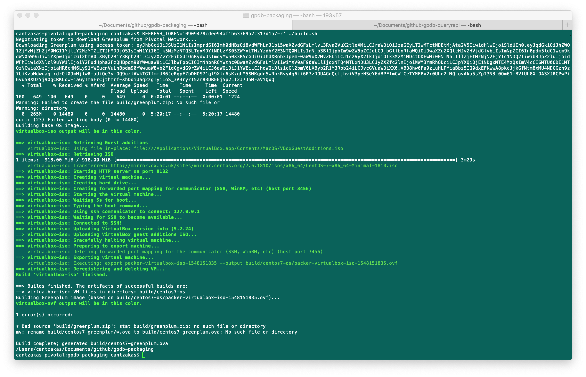

# TODO List
- Update Greenplum Database VM parameters/settings:
  - Change General name to "GPDB-" + {Greenplum Database version major.minor} (extract from GPDB download file?), i.e. GPDB-5.16.0
  - RAM Settings: to i.e. 8192MB
  - Video Memory to 24MB
  - Disable Remote Display
- Enable Port Forwarding in Greenplum Database VM:
  - ssh:tcp:[]:5022:[10.0.2.5]:22 (_assuming VM gets 10.0.2.5 IP upon importing into Virtualbox_)
  - sql:tcp:[]:5432:[10.0.2.5]:5432 (_assuming VM gets 10.0.2.5 IP upon importing into Virtualbox_)
- REFRESH_TOKEN='**********' ./build.sh failed on first execution (see gpdb-packing-error shown below); investigate whether it was connection problem on downloading the GPDB binary file or need to update instructions to include _--force-download_)

- Re-consider whether _configuser_ or _gpadmin_ user should be created by scripts, discuss security around doing so but also consider _gpadmin_ is the "standard" user account used for connecting into the VM via SSH, start and stop the database, etc.

# DONE List
- Update ~/.bashrc with Greenplum Database custom parameters
- Update ~/.bash_profile with Greenplum Database custom parameters
- Create ~/start_all.sh script to start Greenplum Database with parameters
- Create ~/stop_all.sh script to stop Greenplum Database with parameters 